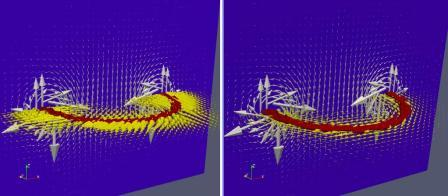

&emsp; Some results of my research on the `BiConjugate Gradient STABilization` (BiCGSTAB) method and  
the `Generalized Minimum RESidual` Method (GMRES) for solving a linear system.

 &emsp;Fortran codes are based on published algorithms:  
 
- the algorithm BiCGSTAB is presented in Xianyi Zeng's lectures :  Algorithm 2.3 Lecture Note 7 
<https://utminers.utep.edu/xzeng/2017spring_math5330/MATH_5330_Computational_Methods_of_Linear_Algebra_files/ln07.pdf>   
- the algorithm GMRES is presented in Wikipedia (Matlab/Octave version): 
<https://en.wikipedia.org/wiki/Generalized_minimal_residual_method>   


### Repository Structure
&emsp; The _/SOLVERS_ directory contains :   
 
 * _/src_  
    - file _SOLVERS_base.f90_  contains an implementation of the BCGSTAB or GMRES methods for solving a linear sparse system: Ax = B. 
    - file _SOLVERS.f90_ oriented on implementation of BCGSTAB or GMRES for calculating 3D fields. Explanations are given below.
    - file _utilites.f90_ contains subroutines for calculating the product of a sparse matrix by a vector,  
converting a matrix from full format to sparse CSR format, inverting a matrix and a subroutine for outputting  
calculation results to csv and vtk files. Paraview may be required to visualization  vtk (free download: <https://www.paraview.org/>).
 * _/example_ - contains _example_SOLVERS_base.f90_  A simple example of solve a sparse system Ax=B using GMRES or BCGSTAB methods.  
A small matrix is entered in full format, which is automatically converted to CSR format.  
 * _/test_ - contains _test_SOLVERS.f90_ this is a test for solving systems of equations for calculating  
three-dimensional vector fields using the BCGSTAB or GMRES methods. Here the field equations are presented  
in the format: $L(X) = B,$ where $L()$ is a linear operator corresponding to the finite-difference approximation of the PDE.  
This version uses a finite-difference approximation of the Laplace equation $L(X) = Laplacian(X)$ and  
a finite-difference approximation of the equation $L(X) = grad(div(X)) - Laplacian(X)$ (this is equivalent to $L(X)=Curl(Curl(X))$  
without using a matrix.  Alternatively, for the Laplacian, on can use a sparse matrix,  
which is automatically generated to solve the equation $Ax=B.$.  
&emsp; All files contain comments.


### Implementation of the BCGSTAB algorithm in Fortran for solve a sparse system $Ax=B$
| algorithm  | code fragments   |
|:-| :-|
|                              |&emsp;call sprsAx(valA, irow, jcol, x, r, n)|
|Compute $r_0 = b- A \cdot x_0$                 |&emsp; r = b - r; r0 = r   |
|  Set $p_0=r_0$                                |&emsp; p = r  |
|  **for** j&numsp;=&numsp;0,1,...&numsp;**do** |&emsp;**do while** (iter <= itmax)|
|                                               |&emsp;&emsp;iter = iter + 1|
|                                               |&emsp;&emsp;call sprsAx(valA, irow, jcol, p, Ap, n)|
|&emsp;choose $r'_0$ such that $r_0 \cdot r'_0 \neq 0$|&emsp;&emsp;rr0 = dot_product(r,r0)|
|&emsp; $\alpha_j=(r_j \cdot r'_0)/((A\cdot p_j)\cdot r'_0)$|&emsp;&emsp;alpha = rr0/dot_product(Ap,r0) |
|&emsp; $s_j=(r_j - \alpha_j\cdot A\cdot p_j)$ |&emsp;&emsp;s = r - alpha*Ap |
|                                              |&emsp;&emsp;call sprsAx(valA, irow, jcol, s, As, n)|
|&emsp; $\omega_j=((A\cdot s_j)\cdot s_j)/((A\cdot s_j)\cdot(A\cdot s_j))$|&emsp;&emsp;omega = dot_product(As,s)/dot_product(As,As)|
|&emsp; $x_{j+1}=x_j + \alpha_j\cdot p_j+\omega_j\cdot s_j$|&emsp;&emsp;x = x + alpha \* p + omega*s|
|&emsp; $r_{j+1}=s_j -\omega_j\cdot A\cdot s_j$     |&emsp;&emsp;r = s - omega\* As|
|&emsp; **if** $||r_{j+1}|| < \epsilon_0$ **then**  |&emsp;&emsp;**if** ( norm2(R) < tolerance) **then** |
| &emsp;&emsp; Break;                               |&emsp;&emsp;&emsp; exit|
|&emsp;**end if**|&emsp;&emsp; **end if**  |
|&emsp; $\beta_j=(\alpha_j/\omega_j)\cdot (r_{j+1}\cdot r'_0)/ (r_j\cdot r'_0)$|&emsp;&emsp;beta = (alpha/omega)\*dot_product(r,r0)/rr0  |
|&emsp; $p_{j*1}=r_{j+1}+\beta_j\cdot (p_j-\omega_j\cdot A\cdot p_j)$|&emsp;&emsp;p = r + beta\*(p - omega\*Ap)|
|**end for**            |&emsp;**end do**      |
|Set $x=x_{j+1}$        | &emsp;print*,x  |


This algorithm is implemented in `SOLVERS_base.f90`. On can notice that here the multiplication of a matrix by a vector  
is applied 3 times through a call to the subroutine **sprsAx**:  

```call sprsAx(valA, irow, jcol, X, B, n)```  

in the GMRES method it is similar, the product of the matrix and the vector is calculated twice.  

&emsp; In `SOLVER.f90` implements a more general approach - instead of calling the **sprsAx** subroutine, the function is calculated:  

```B = approximation(PDE, X) ```  

This function allows you to apply not only the product of a matrix by a vector, but also perform other methods  
of differential-difference approximation:
```
function approximation( PDE, V)
real(8)  approximation( n), V( n )
character(*) PDE
    if   (PDE == 'Laplacian') then
        approximation = -Laplacian( V )
    elseif(PDE == 'CurlCurl') then
        approximation = grad(div(V)) - Laplacian(V)
    elseif(PDE == 'Msparse') then
        approximation = sprsAx(V)
    endif
end function approximation
```
Here on can see that the _Msparse_ approximation, which calls the function of calculating the product  
of a sparse matrix and a vector, is a special case of a more general approach.

### Build

&emsp;Fortran 2018 (gfortran or ifort) is required for build. The _/example_ and _/test_ directories contain the _Makefile_  
(and _Makefile-ifort_) files for building with the _make_ command (or _make -f  Makefile-ifort_).


### Some test calculation results (file /test/test_SOLVERS.f90)  
&emsp;The test was rather qualitative in nature, that is, it did not relate to the calculation of any specific physical structure.  
The test was carried out using the example of calculating a vector field in an domain of 50x50x40 nodes in the direction of the _X, Y, Z_ axes.  
This corresponded to the length of the vector of the calculation result 300000. When using the matrix version,  
the size of the finite-difference approximating matrix $A$ in the equation $Ax=B$ was equal to 300000 by 300000.  
With the 7-point Laplace template and zero Dirichlet boundary conditions, the matrix turns out to be filled only by 0.20844E-02%.  
&emsp; The table below shows the calculation times for _gfortran_ (in the numerator) and _ifort_ (in the denominator).  

| &emsp;approximation |&emsp;  BCGSTAB          | &emsp;  GMRES         |
|  :-:                |:-:                      |  :-:                  |
|**Laplacian**        |  &emsp;0.697s / 0.509s  | &emsp; 4.38s / 3.5s   |
|**Mspars**           |  &emsp;0.812s / 0.658s  | &emsp; 4.45s / 3.35s  |

&emsp; As can be seen from the table, the considered version of the GMRES method is significantly inferior in computation speed to the BCGSTAB method.  
You can notice that with operator approximation, when the matrix is not used, the calculation time is slightly reduced.  

### Matrix-free calculation of the field given by the equation $\nabla \times  \nabla \times \vec{X} = \vec{B}$

The formation of a sparse matrix in this case turns out to be more complex than for the case with the Laplacian.  
Therefore, a matrix-free calculation using operator approximation was applied. In this case, the identity was used:  
$\nabla \times  \nabla \times \vec{X} = \nabla (\nabla \cdot \vec{X} ) - \nabla^2  \vec{X}$  
or in another form of recording:  
$Curl(Curl(\vec{X})) = grad(div(\vec{X})) - Laplacian(\vec{X})$  
Direct use $Curl(Curl(\vec{X}))$ does not work.  

&emsp; The field source was located along a circle located in the center of the computational domain in the _XY_ plane.  
Similar problems are encountered when calculating the electromagnetic field created by an electric current in a ring.  
&emsp; The table below shows the calculation time for _gfortran_ (in the numerator) and _ifort_ (in the denominator)  

| &emsp;approximation |&emsp;  BCGSTAB          | &emsp;  GMRES         |
|  :-:                |:-:                      |  :-:                  |
|**CurlCurl**         |  &emsp; 4.31s / 4.51s  | &emsp; 72.3s / 54.2s   |

Below is an image of the calculated field. $\vec{X}$ in the _XY_ plane and the field image for $\nabla \times \vec{X}$ in the _XZ_ plane for two cases:  
for $\nabla \times \nabla \times \vec{X}=\vec{B}$ (on left) and for  $-\nabla^2  \vec{X}=\vec{B}$ (on right).  

  

  

As on can see, the $\vec{X}$ fields are different. But the field for $\nabla \times \vec{X}$ is the same in both cases.  
This field corresponds to the induction created by the current in the ring.

